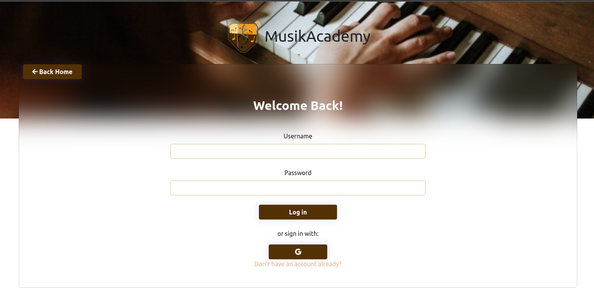
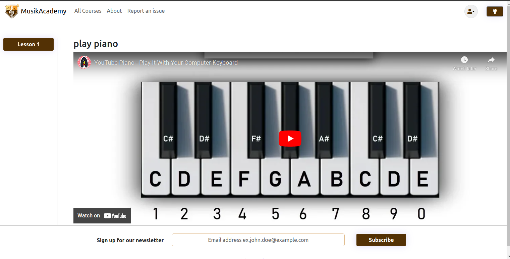

<h1>Musikacademy</h1>

Musikacademy is a full-stack web application 
for learning to play musical 
instruments or providing courses to others.
It is built using Java with Spring Boot 
on the backend and React on the frontend,
and uses PostgreSQL for the database, Hibernate for 
ORM, and Docker for deployment.

<h2>Features</h2>

<ul>
<li>User authentication and authorization with JWT and OAuth2 for social login</li>
<li>Payment integration with Stripe</li>
<li>Email notifications with Spring Starter Mail</li>
<li>User can sign up for courses and view their enrolled courses
<li>Mentor can create courses and manage enrollments</li>
<li>Admin can manage users,mentor applications</li>
<li>Responsive design with Bootstrap</li>
</ul>
<h2>Samples</h2>

<h2>Installation</h2>

To install and run MusikAcademy on your local machine, follow these steps:

<ol>
    <li>Clone the repository: <code>git clone https://github.com/YOUR-USERNAME/musikacademy.git</code></li>
    <li>Navigate to the project directory: <code>cd musikacademy</code></li>
    <li>Install the required dependencies: <code>npm install</code></li>
    <li>Start the development server: <code>npm start</code></li>
</ol>

Note: To run the backend, you need to have Java, Spring Boot, PostgreSQL, and Docker installed on your machine. Please refer to the documentation of each tool for installation instructions.

<h2>Usage</h2>

Once you have installed and run MusikAcademy, you can access the application by navigating to <code>http://localhost:3000</code> in your web browser. You can register as a new user or log in with your existing credentials. After logging in, you can browse the available courses, filter them by name, book and pay for the courses with Stripe. As an admin, you can also manage the users and mentor applications.

<h2>Credits</h2>

MusikAcademy is developed by Bornaz Alex.It was an assignment from Codecool.

